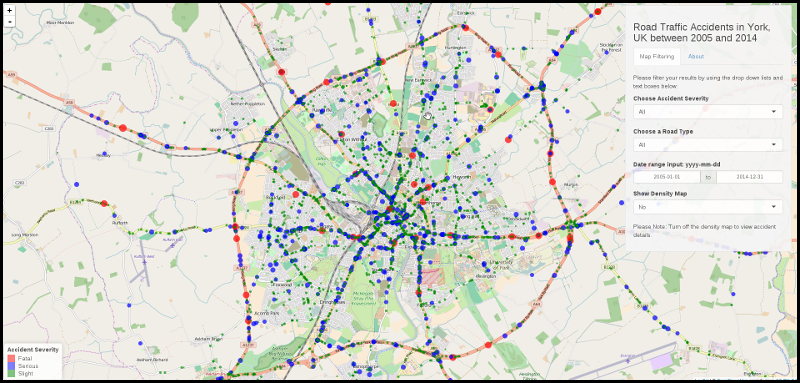

```{r echo=FALSE}
library(ggmap)
library(ggplot2)
library(dplyr)

accidents <- read.csv("./data/accidents.csv", header = TRUE, na.strings = c("","NA","-1"))
```

<style>
.reveal p {
  color: #eeeeee;
  padding-bottom: 20px;
}

.reveal li {
  color: #aaaaaa;
  padding-bottom: 20px;
}

.reveal .norm p {
  text-align: left;
}

.reveal ul {
  display: block;
  text-align: left;
}

</style>


## Road Traffic Accidents in York, UK

### Between 2005 and 2014

#### (Developing Data Products Course Application)
-----------------------------------------



by Jan Tatham

--- {class:  norm}

## Introduction

This presentation is made as part of the Coursera Developing Data Products Course Project.  The objectives of the assignment are to ensure a sound understanding of the following concepts:

* To build a Data Product Application using the Shiny Package
* To produce a Reproducible Pitch Presentation based on the Data Product


--- {class:  norm}

## The Application

The Road Traffic Accidents Application provides the user with an interface to explore and visualise road traffic accidents that occured in York, UK between 2005 and 2014.

The application allows the user to see on a map where to accidents occured, aw well as find out details about the accident by clicking on their placeholder.  Placeholders are colour coded to help the user to see at a glance if the accident had a fatal, serious or slight outcome.

Users are able filter the information via the right hand menu and able to zoom in and out of the map as well as move it around to better understand the results.

The application is available at: [https://sebity.shinyapps.io/road-safety-accidents-york/](https://sebity.shinyapps.io/road-safety-accidents-york/)

--- {class:  norm}

## The Dataset

The Data was published by the City of York Council Department for Transport in the UK, and details data about road traffic accidents within the City of York between 2005 and 2014.

The dataset contains 4778 observations and 32 variables and has been recorded using the STATS19 accident reporting form.

The dataset is available from [DATA.GOK.UK](http://data.yorkopendata.org/dataset/c0eec478-ef19-4234-826f-8efb9563eda2/resource/aa8bcb3d-3945-4347-adc9-24d8e1d3e05c/download/accidents.csv)

The dataset documentation/information is available from the [City of York Council](https://data.yorkopendata.org/dataset/road-safety) website.


---

## Example Density Map

```{r echo = FALSE}
accidents_rt <- accidents %>%
    filter(Road_Type == 3)
```

```{r message=FALSE, warning=FALSE}
map <- get_map(location = "UK, York",zoom=12,maptype="roadmap",color="bw")
p <- ggmap(map)
p <- p + stat_density2d(data=accidents_rt, aes(x = Longitude, y = Latitude,
    fill= ..level.., alpha=..level..), size=5, bins=8, geom="polygon")
print(p)
```
